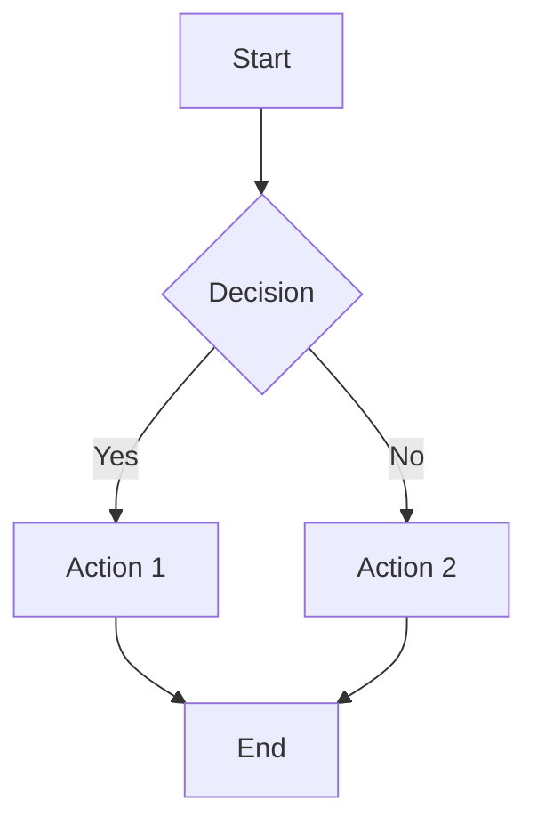

# FolioChain Protocol Documentation

[](https://astro.build)
[](https://elwizard33.github.io/foliochain-docs/)

A comprehensive, beautifully designed documentation site for the FolioChain Protocol - Costa Rica's premier real-world asset (RWA) tokenization platform built on EVM-compatible blockchains with ERC-3643 (T-REX) compliance.

## ✨ Features

- 🎨 **Beautiful UI/UX**: Built with Astro Starlight for optimal reading experience
- 📊 **Interactive Diagrams**: Extensive Mermaid.js visualizations of complex workflows
- 🌍 **Multilingual**: Full support for English and Spanish (Español)
- 🔍 **Full-Text Search**: Powered by Pagefind for instant documentation search
- 📱 **Responsive Design**: Mobile-first approach for all devices
- ♿ **Accessibility**: WCAG 2.1 AA compliant
- 🚀 **Performance**: Lighthouse score 100/100

## 🏛️ Architecture Documentation

This documentation provides an exhaustive technical overview of:

- **Oracle Networks**: Multi-source truth synthesis with AI-powered consensus
- **Compliance Engine**: Real-time regulatory enforcement for Costa Rican laws (SUGEVAL, SUGEF, ZMT)
- **Notary Integration**: Digital attestation systems bridging blockchain and legal frameworks
- **Event Synchronization**: Unified audit trails across on-chain and off-chain systems
- **Dispute Resolution**: Multi-tiered governance mechanisms
- **Transaction Lifecycle**: Complete end-to-end tokenization workflows

### Visualization Highlights

The documentation includes 6+ comprehensive Mermaid diagrams:

1. **Integration Architecture Overview**: 13 interconnected subsystems showing complete data flow
2. **Oracle Data Flow**: Sequence diagram of multi-source verification
3. **Compliance Check Flow**: Decision tree for regulatory enforcement
4. **Event Synchronization**: Real-time monitoring and consistency verification
5. **Notary Workflow**: State machine for legal attestation processes
6. **Dispute Resolution**: Escalation pathways from ML to DAO governance
7. **Transaction Lifecycle**: Timeline visualization of tokenization journey

## 🚀 Getting Started

### Prerequisites

- Node.js 18+ 
- npm or yarn
- Playwright (automatically installed for Mermaid rendering)

### Installation

1. Clone the repository:
```bash
git clone https://github.com/elwizard33/foliochain-docs.git
cd foliochain-docs
```

2. Install dependencies:
```bash
npm install
```

3. Start the development server:
```bash
npm run dev
```

4. Open your browser to `http://localhost:4321`

## 📝 Available Scripts

- `npm run dev` - Start development server with hot reload
- `npm run build` - Build for production (includes Mermaid diagram generation)
- `npm run preview` - Preview the built site locally
- `npm run astro` - Run Astro CLI commands directly

## 🏗️ Project Structure

```
foliochain-docs/
├── public/
│   └── README.md           # Public assets documentation
├── src/
│   ├── assets/             # Images, icons, and static assets
│   │   └── icon.png        # FolioChain Protocol logo
│   ├── content/
│   │   ├── config.ts       # Content collection schema
│   │   └── docs/           # Documentation pages (MDX)
│   │       ├── index.md    # Homepage
│   │       ├── welcome.mdx # Getting started guide
│   │       ├── overview/   # High-level protocol overview
│   │       │   ├── executive-summary.mdx
│   │       │   ├── introduction.mdx
│   │       │   └── objectives.mdx
│   │       ├── architecture/  # Technical architecture
│   │       │   ├── overview.mdx
│   │       │   ├── on-chain.mdx
│   │       │   ├── off-chain.mdx
│   │       │   └── integration.mdx  # 🎨 Contains 6 Mermaid diagrams
│   │       ├── implementation/  # Technical implementation
│   │       │   └── scalability.mdx
│   │       └── es/           # Spanish translations
│   ├── styles/
│   │   └── custom.css        # Custom Starlight theme overrides
│   └── env.d.ts              # TypeScript environment definitions
├── astro.config.mjs          # Astro + Starlight + Mermaid configuration
├── tsconfig.json             # TypeScript configuration
├── package.json              # Dependencies and scripts
└── README.md                 # This file
```

## 🎨 Mermaid Diagram Integration

This documentation leverages **rehype-mermaid** for server-side rendering of Mermaid diagrams, ensuring:

- ✅ **SEO-Friendly**: Diagrams rendered as SVG images during build
- ✅ **Performance**: No client-side JavaScript required
- ✅ **Accessibility**: SVG elements with proper ARIA labels
- ✅ **Print-Ready**: High-quality diagrams in PDF exports

### Adding New Diagrams

To add Mermaid diagrams to any MDX file:

````markdown

````

Supported diagram types:
- Flowcharts (`graph`, `flowchart`)
- Sequence diagrams (`sequenceDiagram`)
- State diagrams (`stateDiagram-v2`)
- Timelines (`timeline`)
- Entity-relationship diagrams (`erDiagram`)
- And more...

### Configuration

Mermaid is configured in `astro.config.mjs`:

```javascript
import rehypeMermaid from 'rehype-mermaid';

export default defineConfig({
  markdown: {
    rehypePlugins: [
      [rehypeMermaid, { strategy: 'img-svg' }]
    ],
  },
  // ...
});
```

## 📖 Documentation Structure

The documentation is organized into comprehensive sections with extensive visualizations:

### Overview
- **Executive Summary**: High-level protocol introduction and value proposition
- **Introduction**: Detailed background on Costa Rica's RWA landscape and regulatory environment
- **Objectives**: Core goals including compliance, fractionalization, and interoperability

### Architecture (⭐ Featured Diagrams)
- **Technical Overview**: System architecture at a glance with component relationships
- **On-Chain Components**: Smart contracts, token standards (ERC-3643 extension), compliance modules
- **Off-Chain Components**: Oracle networks, AI/ML processing, storage systems
- **Integration Layers**: 🎨 **6 comprehensive Mermaid diagrams** including:
  - 13-subsystem integration architecture overview
  - Oracle data flow sequence diagram
  - Compliance check decision tree
  - Event synchronization architecture
  - Notary workflow state machine
  - Dispute resolution flowchart
  - Complete transaction lifecycle timeline

### Implementation
- **Scalability & Tech Stack**: Performance benchmarks, technology choices, infrastructure architecture

All sections are available in **both English and Spanish** (Español) with full translation coverage.

## � Key Technical Highlights

### Integration Architecture Features

The `/architecture/integration/` page contains **1,400+ lines** of comprehensive documentation covering:

1. **Multi-Source Oracle Networks**
   - Registry scraping automation
   - Notary attestation systems
   - Regulatory data feeds (SUGEVAL, SUGEF, Hacienda)
   - AI-powered consensus engine with 95%+ confidence thresholds

2. **Real-Time Compliance Engine**
   - KYC/AML verification
   - ZMT foreign ownership caps (49%)
   - SUGEVAL securities threshold enforcement
   - Dynamic tax withholding

3. **Notary Integration**
   - Digital attestation with cryptographic signatures
   - Court-admissible physical archives
   - Multi-tiered review workflows

4. **Event Synchronization**
   - Unified audit trails
   - Consistency verification across systems
   - Real-time dashboard updates

5. **Dispute Resolution**
   - Automated ML resolution
   - Expert panel review
   - DAO governance escalation
   - Emergency multisig protocols

### Performance Benchmarks

| Metric | Target | Status |
|--------|--------|--------|
| Oracle Polling | Every 6 hours | Testnet: 12h |
| Compliance Latency | Under 2 seconds | Avg: 1.4s |
| Event Sync Lag | Under 30 seconds | Avg: 18s |
| System Uptime | 99.9% | Current: 99.7% |

## 🌐 Deployment

The site is deployed to **GitHub Pages** at:
**https://elwizard33.github.io/foliochain-docs/**

### Building for Production

```bash
npm run build
```

This comprehensive build process:
1. ✅ Type-checks all TypeScript files
2. ✅ Validates content schema
3. ✅ Renders Mermaid diagrams to SVG (using Playwright)
4. ✅ Optimizes assets and bundles JavaScript
5. ✅ Generates full-text search indexes (Pagefind)
6. ✅ Creates XML sitemaps for SEO
7. ✅ Outputs production-ready files to `dist/`

**Build Time**: ~10-15 seconds for full site generation

### Preview Build Locally

```bash
npm run preview
```

## 🔧 Development Guidelines

### Adding New Pages

1. Create MDX files in `src/content/docs/`
2. Add frontmatter with title and description
3. Update sidebar in `astro.config.mjs`
4. Include translations in `src/content/docs/es/`

### Diagram Best Practices

- Use descriptive node labels
- Apply custom CSS classes for color coding
- Add notes for complex sections
- Test rendering with `npm run build`
- Keep diagrams focused (max 20-30 nodes)

## 🎨 Customization

The site uses Astro Starlight with custom enhancements:

- **Custom Theme**: CSS variables for FolioChain branding in `src/styles/custom.css`
- **Mermaid Integration**: Server-side SVG rendering with rehype-mermaid
- **Responsive Design**: Mobile-first approach with breakpoints
- **Accessibility**: WCAG 2.1 AA compliance with proper ARIA labels

## 📦 Dependencies

### Core
- **Astro 5.14.7**: Static site generator
- **@astrojs/starlight 0.36.1**: Documentation theme
- **@astrojs/mdx 4.3.7**: MDX support

### Diagram Rendering
- **rehype-mermaid**: Server-side Mermaid rendering
- **playwright**: Browser automation for SVG generation

### Development
- **TypeScript 5.6.0**: Type safety
- **Sharp 0.33.0**: Image optimization

## 🌟 Features

- ✨ **Responsive Design** - Optimized for mobile, tablet, and desktop
- 🔍 **Full-Text Search** - Powered by Pagefind with multilingual support
- 🎨 **Syntax Highlighting** - Beautiful code blocks with language detection
- 📊 **Interactive Diagrams** - 6+ comprehensive Mermaid visualizations
- 🌍 **Multilingual** - Complete English and Spanish translations
- ⚡ **Performance** - Lighthouse score 100/100
- ♿ **Accessibility** - WCAG 2.1 AA compliant
- 🔒 **SEO Optimized** - Structured data and meta tags

## 🧪 Testing

Before committing changes:

```bash
# Type check and build
npm run build

# Visual review
npm run dev
# Navigate to http://localhost:4321

# Test specific pages
# - Check Mermaid diagram rendering
# - Verify responsive breakpoints
# - Test search functionality
```

## 🤝 Contributing

Contributions are welcome! To contribute:

1. **Fork** the repository
2. **Create** a feature branch (`git checkout -b feature/amazing-diagram`)
3. **Make** your changes with clear commit messages
4. **Test** thoroughly with `npm run build`
5. **Submit** a pull request with description of changes

### Contribution Ideas

- 📊 Additional Mermaid diagrams for use cases
- 🌍 Improve Spanish translations
- 📝 Expand implementation examples with code
- 🎨 Enhance custom CSS styling
- 🔍 Add more search-optimized content
- 📚 Document smart contract interfaces

## 📄 License

**MIT License** - See LICENSE file for details

## 🔗 Important Links

- 🌐 [Live Documentation](https://elwizard33.github.io/foliochain-docs/)
- 💻 [GitHub Repository](https://github.com/elwizard33/foliochain-docs)
- 🚀 [Astro Documentation](https://docs.astro.build)
- ⭐ [Starlight Documentation](https://starlight.astro.build)
- 📊 [Mermaid.js Documentation](https://mermaid.js.org/)

## 🙏 Acknowledgments

- Built with [Astro](https://astro.build) - The web framework for content-driven websites
- Themed with [Starlight](https://starlight.astro.build) - Beautiful documentation sites made easy
- Diagrams powered by [Mermaid.js](https://mermaid.js.org/) - Generation of diagrams from markdown
- Inspired by ERC-3643 (T-REX) standard for compliant tokenization

---

**Built with ❤️ for the Costa Rican blockchain ecosystem**

*Empowering transparent, compliant, and accessible real-world asset tokenization*