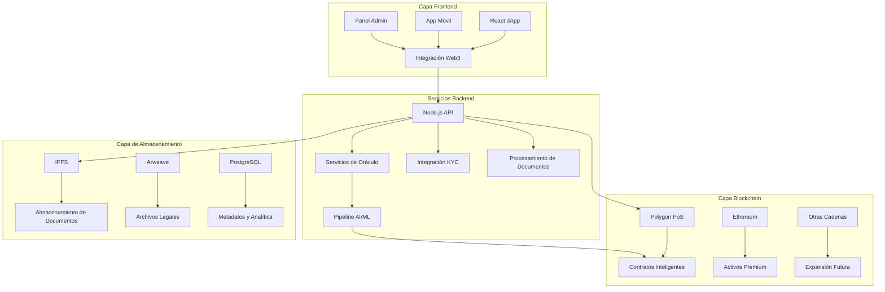

import { Tabs, TabItem, Card, CardGrid, Steps, Aside } from '@astrojs/starlight/components';

Bajo la elegante coreografía de la lógica legal y de cumplimiento del Protocolo FolioChain yace una infraestructura tan deliberada como dinámica—un substrato técnico diseñado para escalar, adaptarse y perdurar en medio de las tectónicas cambiantes de la ley costarricense y los mercados globales de activos. Aquí, cada decisión arquitectónica es una apuesta por el futuro: un compromiso con la inclusividad, auditabilidad y las demandas inflexibles tanto del código como del tribunal.

## Selección de Blockchain: La Fundación Polygon PoS

<Aside type="note">
En la fundación del protocolo está Polygon PoS, elegido no por capricho sino por el cálculo de necesidad—donde las micro-inversiones deben ser viables tanto para agricultores locales como para inversores internacionales.
</Aside>

### ¿Por Qué Polygon PoS?

En una jurisdicción donde los costos de transacción pueden determinar la accesibilidad de inversión, las ventajas de Polygon son decisivas:

<CardGrid stagger>
  <Card title="Costos de Transacción Bajos" icon="approve-check">
    Permite micro-inversiones tan pequeñas como $10-50, crucial para participación local en activos tokenizados
  </Card>
  <Card title="Alto Rendimiento" icon="rocket">
    Soporta miles de transacciones por segundo, acomodando crecimiento en propiedad fraccionada
  </Card>
  <Card title="Compatibilidad EVM" icon="laptop">
    Despliegue fluido de contratos ERC-3643 y ERC-1155 extendidos con soporte completo de herramientas
  </Card>
  <Card title="Seguridad Ethereum" icon="shield">
    Hereda la seguridad probada en batalla de Ethereum mientras proporciona ejecución escalable
  </Card>
</CardGrid>

#### Comparación de Rendimiento: Polygon PoS vs Ethereum Mainnet

<div style="overflow-x: auto; margin: 2rem 0;">
  <table class="comparison-table" style="width: 100%; border-collapse: separate; border-spacing: 0; border-radius: 12px; overflow: hidden; box-shadow: 0 4px 20px rgba(79, 70, 229, 0.15);">
    <thead>
      <tr style="background: linear-gradient(135deg, #4f46e5, #06b6d4);">
        <th style="padding: 1rem; color: white; text-align: left; font-weight: 600;">Métrica</th>
        <th style="padding: 1rem; color: white; text-align: left; font-weight: 600;">Polygon PoS</th>
        <th style="padding: 1rem; color: white; text-align: left; font-weight: 600;">Ethereum Mainnet</th>
        <th style="padding: 1rem; color: white; text-align: left; font-weight: 600;">Ventaja</th>
      </tr>
    </thead>
    <tbody>
      <tr style="border-bottom: 1px solid rgba(79, 70, 229, 0.1);">
        <td style="padding: 1rem; font-weight: 500;">Costo de Transacción</td>
        <td style="padding: 1rem;"><span style="color: #10b981; font-weight: 600;">$0.01 - $0.10</span></td>
        <td style="padding: 1rem;"><span style="color: #ef4444; font-weight: 600;">$5 - $50+</span></td>
        <td style="padding: 1rem;"><span class="metric-badge success">Polygon</span></td>
      </tr>
      <tr style="border-bottom: 1px solid rgba(79, 70, 229, 0.1);">
        <td style="padding: 1rem; font-weight: 500;">Tiempo de Bloque</td>
        <td style="padding: 1rem;"><span style="color: #10b981; font-weight: 600;">~2 segundos</span></td>
        <td style="padding: 1rem;"><span style="color: #f59e0b; font-weight: 600;">~12 segundos</span></td>
        <td style="padding: 1rem;"><span class="metric-badge success">Polygon</span></td>
      </tr>
      <tr style="border-bottom: 1px solid rgba(79, 70, 229, 0.1);">
        <td style="padding: 1rem; font-weight: 500;">Rendimiento (TPS)</td>
        <td style="padding: 1rem;"><span style="color: #10b981; font-weight: 600;">7,000+</span></td>
        <td style="padding: 1rem;"><span style="color: #ef4444; font-weight: 600;">15-30</span></td>
        <td style="padding: 1rem;"><span class="metric-badge success">Polygon</span></td>
      </tr>
      <tr style="border-bottom: 1px solid rgba(79, 70, 229, 0.1);">
        <td style="padding: 1rem; font-weight: 500;">Modelo de Seguridad</td>
        <td style="padding: 1rem;"><span style="color: #4f46e5; font-weight: 600;">PoS anclado en Ethereum</span></td>
        <td style="padding: 1rem;"><span style="color: #10b981; font-weight: 600;">PoS Nativo</span></td>
        <td style="padding: 1rem;"><span class="metric-badge info">Ethereum</span></td>
      </tr>
      <tr style="border-bottom: 1px solid rgba(79, 70, 229, 0.1);">
        <td style="padding: 1rem; font-weight: 500;">Inversión Mínima</td>
        <td style="padding: 1rem;"><span style="color: #10b981; font-weight: 600;">$10 - $50</span></td>
        <td style="padding: 1rem;"><span style="color: #ef4444; font-weight: 600;">$500+ (límites de gas)</span></td>
        <td style="padding: 1rem;"><span class="metric-badge success">Polygon</span></td>
      </tr>
      <tr>
        <td style="padding: 1rem; font-weight: 500;">Caso de Uso Ideal</td>
        <td style="padding: 1rem;"><span style="color: #4f46e5; font-weight: 600;">Propiedad fraccionada, retail</span></td>
        <td style="padding: 1rem;"><span style="color: #4f46e5; font-weight: 600;">Activos premium, instituciones</span></td>
        <td style="padding: 1rem;"><span class="metric-badge info">Dependiente del contexto</span></td>
      </tr>
    </tbody>
  </table>
</div>

### Estrategia Multi-Cadena

La arquitectura blockchain de FCP está diseñada para flexibilidad estratégica:

<Tabs>
  <TabItem label="Polygon PoS (Primaria)">
    **Capa de Despliegue Primaria**
    
    - Todos los contratos centrales del protocolo
    - Comercio y transferencias de tokens fraccionados
    - Distribución de rendimiento y verificaciones de cumplimiento
    - Integración de datos de oráculo en tiempo real
    
    **Ventajas:**
    - Tarifas de transacción de sub-centavo
    - Tiempos de bloque de 2 segundos
    - Adopción institucional probada
    - Integración rica con ecosistema DeFi
  </TabItem>
  
  <TabItem label="Ethereum Mainnet (Premium)">
    **Capa de Activos de Alto Valor**
    
    Reservada para activos premium y transacciones institucionales:
    
    - Propiedades que exceden $10M en valor
    - Tokenización de activos de grado institucional
    - Requisitos de máxima seguridad
    - Escenarios de preferencia regulatoria
    
    **Ruta de Migración:**
    ```solidity
    contract CrossChainAssetBridge {
        function migrateToMainnet(
            uint256 tokenId,
            bytes calldata proof
        ) external onlyAssetOwner(tokenId) {
            require(getAssetValue(tokenId) >= MAINNET_THRESHOLD, "Value too low");
            require(verifyPolygonState(proof), "Invalid state proof");
            
            // Bloquear en Polygon
            polygonContract.lockToken(tokenId);
            
            // Acuñar en Ethereum
            ethereumContract.mintMigratedToken(tokenId, msg.sender, proof);
        }
    }
    ```
  </TabItem>
  
  <TabItem label="Cadenas Futuras">
    **Preparación para Expansión**
    
    Arquitectura preparada para:
    
    - **Base**: L2 de Coinbase para acceso institucional estadounidense
    - **Arbitrum**: Capacidades avanzadas de contratos inteligentes
    - **Solana**: Arquitectura alternativa de alto rendimiento
    - **Avalanche**: Características de cumplimiento amigables con regulación
    
    Compatibilidad cross-chain vía LayerZero y protocolos omnichain similares.
  </TabItem>
</Tabs>

## Estrategia de Despliegue: Faseado y Resiliente

<Aside type="tip">
El despliegue de FCP está orquestado en fases, cada una un enfoque medido para gestión de riesgos, cumplimiento regulatorio y adopción de mercado.
</Aside>

### Lanzamiento Basado en Fases

<Steps>
1. **Desarrollo en Testnet** (Polygon Mumbai)
   - Desarrollo y prueba de contratos inteligentes
   - Integración de oráculos y entrenamiento de modelos IA
   - Incorporación de notarios y validación de flujos de trabajo
   - Participación en sandbox regulatorio

2. **Beta Limitado** (Polygon Mainnet)
   - 3-5 propiedades premium
   - Inversores y notarios en lista blanca
   - Transacciones con dinero real con monitoreo mejorado
   - Validación de cumplimiento regulatorio

3. **Lanzamiento Público** (Multi-Cadena)
   - Marketplace abierto para todas las clases de activos
   - Activación completa de red de oráculos
   - Integración completa con DeFi
   - Acceso de inversores internacionales

4. **Escala Empresarial** (Cross-Chain)
   - Tokenización de activos institucionales
   - Integración de asociaciones gubernamentales
   - Expansión regional (Panamá, Nicaragua)
   - Suite avanzada de productos DeFi
</Steps>

### Arquitectura de Infraestructura



## Optimización de Rendimiento y Escalabilidad

### Optimización de Contratos Inteligentes

FCP emplea técnicas avanzadas de optimización para minimizar costos de gas y maximizar rendimiento:

```solidity
contract OptimizedCompliance {
    // Structs empaquetados para almacenamiento eficiente
    struct PackedUserData {
        uint128 kycTimestamp;
        uint64 riskScore;
        uint32 nationality;
        uint32 flags;
    }
    
    // Bitmap para seguimiento eficiente de reclamaciones
    mapping(address => uint256) public claimBitmaps;
    
    function hasValidClaim(address user, uint8 claimType) 
        external view returns (bool) 
    {
        return (claimBitmaps[user] >> claimType) & 1 == 1;
    }
    
    // Operaciones en lote para eficiencia de gas
    function batchTransfer(
        address[] calldata recipients,
        uint256[] calldata amounts
    ) external {
        require(recipients.length == amounts.length, "Array mismatch");
        
        for (uint i = 0; i < recipients.length; i++) {
            _transfer(msg.sender, recipients[i], amounts[i]);
        }
    }
}
```

### Soluciones de Escalado Off-Chain

<Tabs>
  <TabItem label="Arquitectura de Microservicios">
    **Servicios Escalables Horizontalmente**
    
    ```yaml
    # Configuración de escalado Docker Compose
    version: '3.8'
    services:
      oracle-service:
        image: foliochain/oracle:latest
        deploy:
          replicas: 5
          resources:
            limits:
              cpus: '0.5'
              memory: 512M
    
      ai-processor:
        image: foliochain/ai-processor:latest
        deploy:
          replicas: 3
          resources:
            limits:
              cpus: '2.0'
              memory: 4G
              
      compliance-engine:
        image: foliochain/compliance:latest
        deploy:
          replicas: 4
    ```
  </TabItem>
  
  <TabItem label="Estrategia de Caché">
    **Caché Multi-Capa**
    
    ```javascript
    class CacheManager {
        constructor() {
            this.redisClient = new Redis(process.env.REDIS_URL);
            this.memoryCache = new Map();
        }
        
        async getCachedData(key, fetchFunction, ttl = 3600) {
            // L1: Caché de memoria
            if (this.memoryCache.has(key)) {
                return this.memoryCache.get(key);
            }
            
            // L2: Caché Redis
            const cached = await this.redisClient.get(key);
            if (cached) {
                const data = JSON.parse(cached);
                this.memoryCache.set(key, data);
                return data;
            }
            
            // L3: Obtener y cachear
            const data = await fetchFunction();
            await this.redisClient.setex(key, ttl, JSON.stringify(data));
            this.memoryCache.set(key, data);
            return data;
        }
    }
    ```
  </TabItem>
  
  <TabItem label="Optimización de Base de Datos">
    **Ajuste de Rendimiento PostgreSQL**
    
    ```sql
    -- Índices optimizados para consultas frecuentes
    CREATE INDEX CONCURRENTLY idx_assets_folio_real 
    ON assets USING btree (folio_real_id);
    
    CREATE INDEX CONCURRENTLY idx_transactions_timestamp 
    ON transactions USING btree (created_at DESC);
    
    -- Tablas particionadas para grandes conjuntos de datos
    CREATE TABLE compliance_logs (
        id BIGSERIAL,
        user_address VARCHAR(42),
        check_type VARCHAR(50),
        result BOOLEAN,
        timestamp TIMESTAMP DEFAULT NOW()
    ) PARTITION BY RANGE (timestamp);
    ```
  </TabItem>
</Tabs>

## Inmersión Profunda en Stack Tecnológico

### Tecnologías Frontend

<CardGrid>
  <Card title="React 18" icon="laptop">
    **Framework UI Moderno**
    - Renderizado del lado del servidor con Next.js
    - Arquitectura basada en componentes
    - TypeScript para seguridad de tipos
    - Diseño responsivo con Tailwind CSS
  </Card>
  
  <Card title="Integración Web3" icon="puzzle">
    **Conectividad Blockchain**
    - Ethers.js v6 para interacción con contratos
    - Soporte MetaMask y WalletConnect
    - Gestión de billetera multi-cadena
    - Batching y optimización de transacciones
  </Card>
  
  <Card title="Gestión de Estado" icon="approve-check">
    **Estado de Aplicación**
    - Redux Toolkit para estado global
    - React Query para estado del servidor
    - Sincronización de estado Web3
    - Arquitectura offline-first
  </Card>
</CardGrid>

### Arquitectura Backend

```javascript
// API Express.js con middleware completo
const app = express();

// Middleware de seguridad
app.use(helmet());
app.use(cors({
    origin: process.env.ALLOWED_ORIGINS?.split(','),
    credentials: true
}));

// Limitación de tasa
app.use('/api/', rateLimit({
    windowMs: 15 * 60 * 1000, // 15 minutos
    max: 100, // limitar cada IP a 100 solicitudes por windowMs
    message: 'Too many requests from this IP'
}));

// Autenticación
app.use('/api/protected', authMiddleware);

// Rutas API
app.use('/api/assets', assetRoutes);
app.use('/api/compliance', complianceRoutes);
app.use('/api/oracles', oracleRoutes);
```

### Infraestructura AI/ML

<Tabs>
  <TabItem label="Procesamiento de Documentos">
    **Pipeline de Procesamiento de Lenguaje Natural**
    
    ```python
    class DocumentProcessor:
        def __init__(self):
            self.nlp = spacy.load("es_core_news_lg")  # Modelo español
            self.ocr = pytesseract
            self.classifier = self.load_legal_classifier()
            
        def process_legal_document(self, document_path):
            # Extracción OCR
            text = self.ocr.image_to_string(
                document_path, 
                lang='spa',
                config='--oem 3 --psm 6'
            )
            
            # Procesamiento NLP
            doc = self.nlp(text)
            
            # Extracción de entidades
            entities = {
                'folio_real': self.extract_folio_real(doc),
                'owner': self.extract_owner_name(doc),
                'encumbrances': self.extract_encumbrances(doc),
                'legal_status': self.classify_status(doc)
            }
            
            return entities
    ```
  </TabItem>
  
  <TabItem label="Detección de Anomalías">
    **Modelos de Machine Learning**
    
    ```python
    class AnomalyDetector:
        def __init__(self):
            self.isolation_forest = IsolationForest(contamination=0.1)
            self.lstm_model = self.load_lstm_model()
            
        def detect_suspicious_patterns(self, transaction_data):
            # Ingeniería de características
            features = self.extract_features(transaction_data)
            
            # Isolation Forest para detección de outliers
            outlier_scores = self.isolation_forest.decision_function(features)
            
            # LSTM para análisis de patrones temporales
            sequence_anomalies = self.lstm_model.predict(
                self.prepare_sequences(transaction_data)
            )
            
            return {
                'outlier_score': outlier_scores.mean(),
                'temporal_anomalies': sequence_anomalies,
                'risk_level': self.calculate_risk_level(outlier_scores, sequence_anomalies)
            }
    ```
  </TabItem>
</Tabs>

## Arquitectura de Seguridad

<Aside type="caution">
La seguridad en FCP aborda tanto amenazas tradicionales de ciberseguridad como riesgos legales y regulatorios específicos de Costa Rica mediante estrategias completas de defensa en profundidad.
</Aside>

### Modelo de Seguridad Multi-Capa

<Steps>
1. **Seguridad de Red**
   - Protección DDoS vía Cloudflare
   - Reglas WAF para protección de API
   - Acceso VPN para operaciones sensibles
   - Bloqueo geográfico para regiones de alto riesgo

2. **Seguridad de Aplicación**
   - Validación y sanitización de entrada
   - Prevención de inyección SQL
   - Protección XSS con headers CSP
   - Cumplimiento de directrices de seguridad OWASP

3. **Seguridad de Contratos Inteligentes**
   - Verificación formal con Certora
   - Auditorías de terceros (OpenZeppelin, Consensys)
   - Mecanismos de actualización con timelocks
   - Funcionalidad de pausa de emergencia

4. **Seguridad de Datos**
   - Encriptación en reposo (AES-256)
   - Encriptación en tránsito (TLS 1.3)
   - Gestión de claves con HSMs
   - Evaluaciones de seguridad regulares
</Steps>

### Plan de Respuesta a Incidentes

```javascript
class SecurityIncidentResponse {
    constructor() {
        this.alertingSystem = new AlertingSystem();
        this.emergencyContacts = loadEmergencyContacts();
    }
    
    async handleSecurityIncident(incident) {
        const severity = this.assessSeverity(incident);
        
        switch (severity) {
            case 'CRITICAL':
                await this.emergencyPause();
                await this.notifyRegulators();
                await this.activateIncidentTeam();
                break;
                
            case 'HIGH':
                await this.pauseAffectedAssets(incident.affectedAssets);
                await this.notifyStakeholders();
                break;
                
            case 'MEDIUM':
                await this.logIncident(incident);
                await this.scheduleReview();
                break;
        }
    }
}
```

## Monitoreo y Observabilidad

### Monitoreo Completo del Sistema

<Tabs>
  <TabItem label="Métricas de Aplicación">
    **Monitoreo de Rendimiento y Salud**
    
    ```javascript
    // Recopilación de métricas Prometheus
    const promClient = require('prom-client');
    
    const httpRequestDuration = new promClient.Histogram({
        name: 'http_request_duration_seconds',
        help: 'Duration of HTTP requests in seconds',
        labelNames: ['method', 'route', 'status_code']
    });
    
    const complianceCheckCounter = new promClient.Counter({
        name: 'compliance_checks_total',
        help: 'Total number of compliance checks performed',
        labelNames: ['check_type', 'result']
    });
    ```
  </TabItem>
  
  <TabItem label="Monitoreo Blockchain">
    **Seguimiento de Actividad On-Chain**
    
    ```javascript
    class BlockchainMonitor {
        constructor() {
            this.web3 = new Web3(process.env.RPC_URL);
            this.contracts = loadContracts();
        }
        
        async monitorTransactions() {
            this.contracts.forEach(contract => {
                contract.events.allEvents()
                    .on('data', this.processEvent)
                    .on('error', this.handleError);
            });
        }
        
        processEvent(event) {
            // Registrar en sistema de monitoreo
            logger.info('Blockchain event', {
                contract: event.address,
                event: event.event,
                transactionHash: event.transactionHash,
                blockNumber: event.blockNumber
            });
            
            // Verificar anomalías
            if (this.isAnomalousEvent(event)) {
                this.alertingSystem.sendAlert('Anomalous blockchain event detected', event);
            }
        }
    }
    ```
  </TabItem>
  
  <TabItem label="Métricas de Negocio">
    **Panel de KPI**
    
    Métricas clave rastreadas en tiempo real:
    
    - Valor total bloqueado (TVL)
    - Número de propiedades tokenizadas
    - Tasas de conversión de incorporación de usuarios
    - Tasas de éxito de verificaciones de cumplimiento
    - Métricas de precisión de datos de oráculo
    - Rendimiento de distribución de rendimiento
  </TabItem>
</Tabs>

## Preparación para el Futuro y Extensibilidad

<Aside type="note">
La arquitectura de FCP está diseñada para evolucionar con paisajes tecnológicos cambiantes, requisitos regulatorios y demandas de mercado mientras mantiene compatibilidad hacia atrás y continuidad operacional.
</Aside>

### Beneficios de Arquitectura Modular

- **Adaptación Regulatoria**: Nuevos módulos de cumplimiento pueden desplegarse sin tiempo de inactividad del sistema
- **Evolución Tecnológica**: Componentes individuales pueden actualizarse independientemente
- **Expansión Geográfica**: Redes de oráculos adicionales e integraciones legales pueden añadirse fluídamente
- **Extensión de Clase de Activos**: Nuevos estándares de tokens y tipos de activos pueden integrarse modularmente

### Mecanismos de Actualización

```solidity
contract UpgradeableProtocol {
    using UUPSUpgradeable for address;
    
    struct UpgradeProposal {
        address newImplementation;
        bytes initData;
        uint256 proposalTime;
        uint256 executionTime;
        bool executed;
    }
    
    mapping(bytes32 => UpgradeProposal) public upgradeProposals;
    uint256 public constant UPGRADE_DELAY = 7 days;
    
    function proposeUpgrade(
        address newImplementation,
        bytes calldata initData
    ) external onlyGovernance {
        bytes32 proposalId = keccak256(abi.encode(newImplementation, initData, block.timestamp));
        
        upgradeProposals[proposalId] = UpgradeProposal({
            newImplementation: newImplementation,
            initData: initData,
            proposalTime: block.timestamp,
            executionTime: block.timestamp + UPGRADE_DELAY,
            executed: false
        });
        
        emit UpgradeProposed(proposalId, newImplementation);
    }
}
```

## Conclusión: Ingeniería para el Mañana

La fundación técnica del Protocolo FolioChain representa más que infraestructura—encarna una filosofía de resiliencia adaptativa, previsión regulatoria y accesibilidad inclusiva. Cada decisión arquitectónica, desde la selección de blockchain hasta los sistemas de monitoreo, refleja un compromiso de construir no solo para el mercado inmobiliario costarricense de hoy, sino para la economía tokenizada global del mañana.

A medida que las regulaciones evolucionan, las tecnologías avanzan y los mercados maduran, la arquitectura modular, actualizable y extensamente monitoreada de FCP asegura que los activos tokenizados de Costa Rica puedan crecer, adaptarse y prosperar en cualquier futuro que emerja. El protocolo está listo no solo para tokenizar bienes raíces, sino para transformar cómo economías enteras piensan sobre propiedad de activos, accesibilidad de inversión e inclusión financiera.
