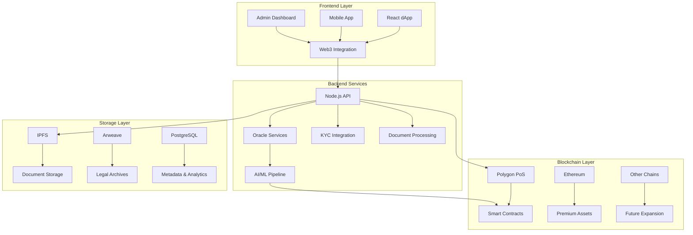

Beneath the elegant choreography of FolioChain Protocol's legal and compliance logic lies an infrastructure as deliberate as it is dynamic—a technical substratum engineered to scale, adapt, and endure amidst the shifting tectonics of Costa Rican law and global asset markets. Here, every architectural decision is a wager on the future: a commitment to inclusivity, auditability, and the unyielding demands of both code and court.

## Blockchain Selection: The Polygon PoS Foundation

<Aside type="note">
At the protocol's foundation stands Polygon PoS, chosen not by whim but by the calculus of necessity—where micro-investments must be viable for local farmers and international investors alike.
</Aside>

### Why Polygon PoS?

In a jurisdiction where transaction costs can determine investment accessibility, Polygon's advantages are decisive:

<CardGrid stagger>
  <Card title="Low Transaction Costs" icon="approve-check">
    Enables micro-investments as small as $10-50, crucial for local participation in tokenized assets
  </Card>
  <Card title="High Throughput" icon="rocket">
    Supports thousands of transactions per second, accommodating growth in fractional ownership
  </Card>
  <Card title="EVM Compatibility" icon="laptop">
    Seamless deployment of extended ERC-3643 and ERC-1155 contracts with full tooling support
  </Card>
  <Card title="Ethereum Security" icon="shield">
    Inherits Ethereum's battle-tested security while providing scalable execution
  </Card>
</CardGrid>

### Multi-Chain Strategy

FCP's blockchain architecture is designed for strategic flexibility:

<Tabs>
  <TabItem label="Polygon PoS (Primary)">
    **Primary Deployment Layer**
    
    - All core protocol contracts
    - Fractional token trading and transfers
    - Yield distribution and compliance checks
    - Real-time oracle data integration
    
    **Advantages:**
    - Sub-cent transaction fees
    - 2-second block times
    - Proven institutional adoption
    - Rich DeFi ecosystem integration
  </TabItem>
  
  <TabItem label="Ethereum Mainnet (Premium)">
    **High-Value Asset Layer**
    
    Reserved for premium assets and institutional transactions:
    
    - Properties exceeding $10M in value
    - Institutional-grade asset tokenization
    - Maximum security requirements
    - Regulatory preference scenarios
    
    **Migration Path:**
    ```solidity
    contract CrossChainAssetBridge {
        function migrateToMainnet(
            uint256 tokenId,
            bytes calldata proof
        ) external onlyAssetOwner(tokenId) {
            require(getAssetValue(tokenId) >= MAINNET_THRESHOLD, "Value too low");
            require(verifyPolygonState(proof), "Invalid state proof");
            
            // Lock on Polygon
            polygonContract.lockToken(tokenId);
            
            // Mint on Ethereum
            ethereumContract.mintMigratedToken(tokenId, msg.sender, proof);
        }
    }
    ```
  </TabItem>
  
  <TabItem label="Future Chains">
    **Expansion Readiness**
    
    Architecture prepared for:
    
    - **Base**: Coinbase's L2 for US institutional access
    - **Arbitrum**: Advanced smart contract capabilities
    - **Solana**: High-performance alternative architecture
    - **Avalanche**: Regulatory-friendly compliance features
    
    Cross-chain compatibility via LayerZero and similar omnichain protocols.
  </TabItem>
</Tabs>

## Deployment Strategy: Phased and Resilient

<Aside type="tip">
FCP's deployment is orchestrated in phases, each a measured approach to risk management, regulatory compliance, and market adoption.
</Aside>

### Phase-Based Rollout

<Steps>
1. **Testnet Development** (Polygon Mumbai)
   - Smart contract development and testing
   - Oracle integration and AI model training
   - Notary onboarding and workflow validation
   - Regulatory sandbox participation

2. **Limited Beta** (Polygon Mainnet)
   - 3-5 premium properties
   - Whitelisted investors and notaries
   - Real-money transactions with enhanced monitoring
   - Regulatory compliance validation

3. **Public Launch** (Multi-Chain)
   - Open marketplace for all asset classes
   - Full oracle network activation
   - Complete DeFi integration
   - International investor access

4. **Enterprise Scale** (Cross-Chain)
   - Institutional asset tokenization
   - Government partnership integration
   - Regional expansion (Panama, Nicaragua)
   - Advanced DeFi product suite
</Steps>

### Infrastructure Architecture



## Performance Optimization and Scalability

### Smart Contract Optimization

FCP employs advanced optimization techniques to minimize gas costs and maximize performance:

```solidity
contract OptimizedCompliance {
    // Packed structs for efficient storage
    struct PackedUserData {
        uint128 kycTimestamp;
        uint64 riskScore;
        uint32 nationality;
        uint32 flags;
    }
    
    // Bitmap for efficient claim tracking
    mapping(address => uint256) public claimBitmaps;
    
    function hasValidClaim(address user, uint8 claimType) 
        external view returns (bool) 
    {
        return (claimBitmaps[user] >> claimType) & 1 == 1;
    }
    
    // Batch operations for gas efficiency
    function batchTransfer(
        address[] calldata recipients,
        uint256[] calldata amounts
    ) external {
        require(recipients.length == amounts.length, "Array mismatch");
        
        for (uint i = 0; i < recipients.length; i++) {
            _transfer(msg.sender, recipients[i], amounts[i]);
        }
    }
}
```

### Off-Chain Scaling Solutions

<Tabs>
  <TabItem label="Microservices Architecture">
    **Horizontally Scalable Services**
    
    ```yaml
    # Docker Compose scaling configuration
    version: '3.8'
    services:
      oracle-service:
        image: foliochain/oracle:latest
        deploy:
          replicas: 5
          resources:
            limits:
              cpus: '0.5'
              memory: 512M
    
      ai-processor:
        image: foliochain/ai-processor:latest
        deploy:
          replicas: 3
          resources:
            limits:
              cpus: '2.0'
              memory: 4G
              
      compliance-engine:
        image: foliochain/compliance:latest
        deploy:
          replicas: 4
    ```
  </TabItem>
  
  <TabItem label="Caching Strategy">
    **Multi-Layer Caching**
    
    ```javascript
    class CacheManager {
        constructor() {
            this.redisClient = new Redis(process.env.REDIS_URL);
            this.memoryCache = new Map();
        }
        
        async getCachedData(key, fetchFunction, ttl = 3600) {
            // L1: Memory cache
            if (this.memoryCache.has(key)) {
                return this.memoryCache.get(key);
            }
            
            // L2: Redis cache
            const cached = await this.redisClient.get(key);
            if (cached) {
                const data = JSON.parse(cached);
                this.memoryCache.set(key, data);
                return data;
            }
            
            // L3: Fetch and cache
            const data = await fetchFunction();
            await this.redisClient.setex(key, ttl, JSON.stringify(data));
            this.memoryCache.set(key, data);
            return data;
        }
    }
    ```
  </TabItem>
  
  <TabItem label="Database Optimization">
    **PostgreSQL Performance Tuning**
    
    ```sql
    -- Optimized indexes for frequent queries
    CREATE INDEX CONCURRENTLY idx_assets_folio_real 
    ON assets USING btree (folio_real_id);
    
    CREATE INDEX CONCURRENTLY idx_transactions_timestamp 
    ON transactions USING btree (created_at DESC);
    
    -- Partitioned tables for large datasets
    CREATE TABLE compliance_logs (
        id BIGSERIAL,
        user_address VARCHAR(42),
        check_type VARCHAR(50),
        result BOOLEAN,
        timestamp TIMESTAMP DEFAULT NOW()
    ) PARTITION BY RANGE (timestamp);
    ```
  </TabItem>
</Tabs>

## Technology Stack Deep Dive

### Frontend Technologies

<CardGrid>
  <Card title="React 18" icon="laptop">
    **Modern UI Framework**
    - Server-side rendering with Next.js
    - Component-based architecture
    - TypeScript for type safety
    - Responsive design with Tailwind CSS
  </Card>
  
  <Card title="Web3 Integration" icon="puzzle">
    **Blockchain Connectivity**
    - Ethers.js v6 for contract interaction
    - MetaMask and WalletConnect support
    - Multi-chain wallet management
    - Transaction batching and optimization
  </Card>
  
  <Card title="State Management" icon="approve-check">
    **Application State**
    - Redux Toolkit for global state
    - React Query for server state
    - Web3 state synchronization
    - Offline-first architecture
  </Card>
</CardGrid>

### Backend Architecture

```javascript
// Express.js API with comprehensive middleware
const app = express();

// Security middleware
app.use(helmet());
app.use(cors({
    origin: process.env.ALLOWED_ORIGINS?.split(','),
    credentials: true
}));

// Rate limiting
app.use('/api/', rateLimit({
    windowMs: 15 * 60 * 1000, // 15 minutes
    max: 100, // limit each IP to 100 requests per windowMs
    message: 'Too many requests from this IP'
}));

// Authentication
app.use('/api/protected', authMiddleware);

// API routes
app.use('/api/assets', assetRoutes);
app.use('/api/compliance', complianceRoutes);
app.use('/api/oracles', oracleRoutes);
```

### AI/ML Infrastructure

<Tabs>
  <TabItem label="Document Processing">
    **Natural Language Processing Pipeline**
    
    ```python
    class DocumentProcessor:
        def __init__(self):
            self.nlp = spacy.load("es_core_news_lg")  # Spanish model
            self.ocr = pytesseract
            self.classifier = self.load_legal_classifier()
            
        def process_legal_document(self, document_path):
            # OCR extraction
            text = self.ocr.image_to_string(
                document_path, 
                lang='spa',
                config='--oem 3 --psm 6'
            )
            
            # NLP processing
            doc = self.nlp(text)
            
            # Entity extraction
            entities = {
                'folio_real': self.extract_folio_real(doc),
                'owner': self.extract_owner_name(doc),
                'encumbrances': self.extract_encumbrances(doc),
                'legal_status': self.classify_status(doc)
            }
            
            return entities
    ```
  </TabItem>
  
  <TabItem label="Anomaly Detection">
    **Machine Learning Models**
    
    ```python
    class AnomalyDetector:
        def __init__(self):
            self.isolation_forest = IsolationForest(contamination=0.1)
            self.lstm_model = self.load_lstm_model()
            
        def detect_suspicious_patterns(self, transaction_data):
            # Feature engineering
            features = self.extract_features(transaction_data)
            
            # Isolation Forest for outlier detection
            outlier_scores = self.isolation_forest.decision_function(features)
            
            # LSTM for temporal pattern analysis
            sequence_anomalies = self.lstm_model.predict(
                self.prepare_sequences(transaction_data)
            )
            
            return {
                'outlier_score': outlier_scores.mean(),
                'temporal_anomalies': sequence_anomalies,
                'risk_level': self.calculate_risk_level(outlier_scores, sequence_anomalies)
            }
    ```
  </TabItem>
</Tabs>

## Security Architecture

<Aside type="caution">
Security in FCP addresses both traditional cybersecurity threats and Costa Rica-specific legal and regulatory risks through comprehensive defense-in-depth strategies.
</Aside>

### Multi-Layer Security Model

<Steps>
1. **Network Security**
   - DDoS protection via Cloudflare
   - WAF rules for API protection
   - VPN access for sensitive operations
   - Geographic blocking for high-risk regions

2. **Application Security**
   - Input validation and sanitization
   - SQL injection prevention
   - XSS protection with CSP headers
   - OWASP security guidelines compliance

3. **Smart Contract Security**
   - Formal verification with Certora
   - Third-party audits (OpenZeppelin, Consensys)
   - Upgrade mechanisms with timelocks
   - Emergency pause functionality

4. **Data Security**
   - Encryption at rest (AES-256)
   - Encryption in transit (TLS 1.3)
   - Key management with HSMs
   - Regular security assessments
</Steps>

### Incident Response Plan

```javascript
class SecurityIncidentResponse {
    constructor() {
        this.alertingSystem = new AlertingSystem();
        this.emergencyContacts = loadEmergencyContacts();
    }
    
    async handleSecurityIncident(incident) {
        const severity = this.assessSeverity(incident);
        
        switch (severity) {
            case 'CRITICAL':
                await this.emergencyPause();
                await this.notifyRegulators();
                await this.activateIncidentTeam();
                break;
                
            case 'HIGH':
                await this.pauseAffectedAssets(incident.affectedAssets);
                await this.notifyStakeholders();
                break;
                
            case 'MEDIUM':
                await this.logIncident(incident);
                await this.scheduleReview();
                break;
        }
    }
}
```

## Monitoring and Observability

### Comprehensive System Monitoring

<Tabs>
  <TabItem label="Application Metrics">
    **Performance and Health Monitoring**
    
    ```javascript
    // Prometheus metrics collection
    const promClient = require('prom-client');
    
    const httpRequestDuration = new promClient.Histogram({
        name: 'http_request_duration_seconds',
        help: 'Duration of HTTP requests in seconds',
        labelNames: ['method', 'route', 'status_code']
    });
    
    const complianceCheckCounter = new promClient.Counter({
        name: 'compliance_checks_total',
        help: 'Total number of compliance checks performed',
        labelNames: ['check_type', 'result']
    });
    ```
  </TabItem>
  
  <TabItem label="Blockchain Monitoring">
    **On-Chain Activity Tracking**
    
    ```javascript
    class BlockchainMonitor {
        constructor() {
            this.web3 = new Web3(process.env.RPC_URL);
            this.contracts = loadContracts();
        }
        
        async monitorTransactions() {
            this.contracts.forEach(contract => {
                contract.events.allEvents()
                    .on('data', this.processEvent)
                    .on('error', this.handleError);
            });
        }
        
        processEvent(event) {
            // Log to monitoring system
            logger.info('Blockchain event', {
                contract: event.address,
                event: event.event,
                transactionHash: event.transactionHash,
                blockNumber: event.blockNumber
            });
            
            // Check for anomalies
            if (this.isAnomalousEvent(event)) {
                this.alertingSystem.sendAlert('Anomalous blockchain event detected', event);
            }
        }
    }
    ```
  </TabItem>
  
  <TabItem label="Business Metrics">
    **KPI Dashboard**
    
    Key metrics tracked in real-time:
    
    - Total value locked (TVL)
    - Number of tokenized properties
    - User onboarding conversion rates
    - Compliance check success rates
    - Oracle data accuracy metrics
    - Yield distribution performance
  </TabItem>
</Tabs>

## Future-Proofing and Extensibility

<Aside type="note">
FCP's architecture is designed to evolve with changing technology landscapes, regulatory requirements, and market demands while maintaining backward compatibility and operational continuity.
</Aside>

### Modular Architecture Benefits

- **Regulatory Adaptation**: New compliance modules can be deployed without system downtime
- **Technology Evolution**: Individual components can be upgraded independently
- **Geographic Expansion**: Additional oracle networks and legal integrations can be added seamlessly
- **Asset Class Extension**: New token standards and asset types can be integrated modularly

### Upgrade Mechanisms

```solidity
contract UpgradeableProtocol {
    using UUPSUpgradeable for address;
    
    struct UpgradeProposal {
        address newImplementation;
        bytes initData;
        uint256 proposalTime;
        uint256 executionTime;
        bool executed;
    }
    
    mapping(bytes32 => UpgradeProposal) public upgradeProposals;
    uint256 public constant UPGRADE_DELAY = 7 days;
    
    function proposeUpgrade(
        address newImplementation,
        bytes calldata initData
    ) external onlyGovernance {
        bytes32 proposalId = keccak256(abi.encode(newImplementation, initData, block.timestamp));
        
        upgradeProposals[proposalId] = UpgradeProposal({
            newImplementation: newImplementation,
            initData: initData,
            proposalTime: block.timestamp,
            executionTime: block.timestamp + UPGRADE_DELAY,
            executed: false
        });
        
        emit UpgradeProposed(proposalId, newImplementation);
    }
}
```

## Conclusion: Engineering for Tomorrow

The FolioChain Protocol's technical foundation represents more than infrastructure—it embodies a philosophy of adaptive resilience, regulatory foresight, and inclusive accessibility. Every architectural decision, from blockchain selection to monitoring systems, reflects a commitment to building not just for today's Costa Rican real estate market, but for tomorrow's global tokenized economy.

As regulations evolve, technologies advance, and markets mature, FCP's modular, upgradeable, and extensively monitored architecture ensures that Costa Rica's tokenized assets can grow, adapt, and thrive in whatever future emerges. The protocol stands ready not just to tokenize real estate, but to transform how entire economies think about asset ownership, investment accessibility, and financial inclusion.